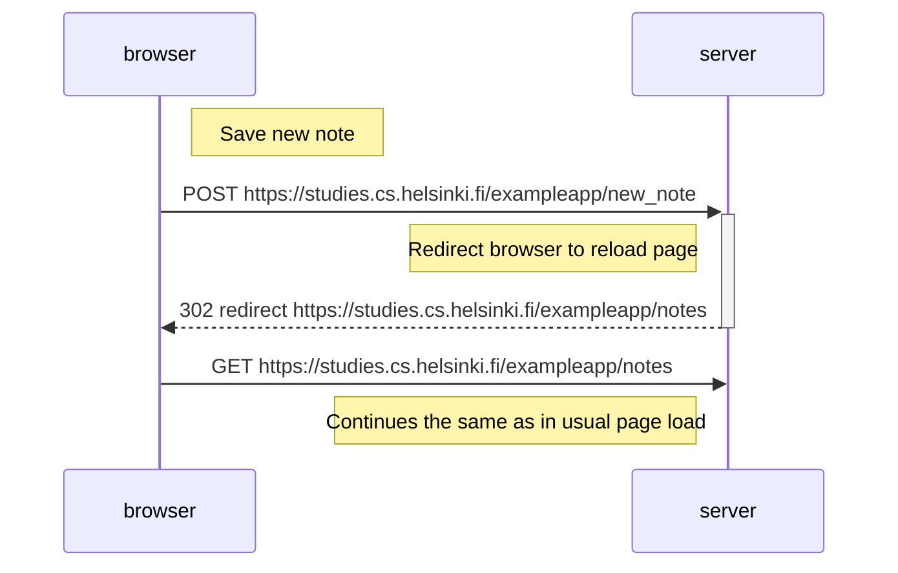
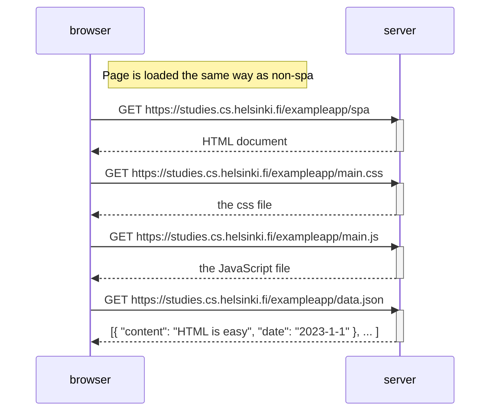
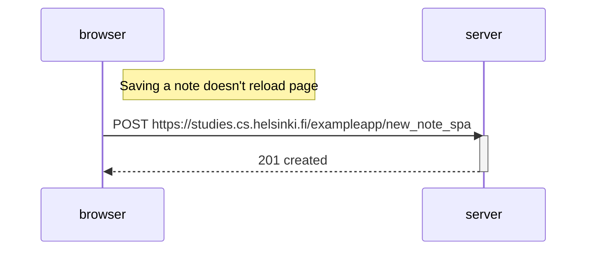

0.4 - uuden muistiinpanon tekeminen lataa sivun uudelleen

```mermaid
sequenceDiagram
    participant browser
    participant server

    Note right of browser: Save new note
    browser->>+server: POST https://studies.cs.helsinki.fi/exampleapp/new_note 

    Note left of server: Redirect browser to reload page
    server-->>-browser: 302 redirect https://studies.cs.helsinki.fi/exampleapp/notes
    
    browser->>server: GET https://studies.cs.helsinki.fi/exampleapp/notes
    Note left of server: Continues the same as in usual page load

```
0.5 - SPA sivu ladataaan samalla tavalla

```mermaid
sequenceDiagram
    participant browser
    participant server

    Note right of browser: Page is loaded the same way as non-spa
    
    browser->>server: GET https://studies.cs.helsinki.fi/exampleapp/spa
    activate server
    server-->>browser: HTML document
    deactivate server
    
    browser->>server: GET https://studies.cs.helsinki.fi/exampleapp/main.css
    activate server
    server-->>browser: the css file
    deactivate server
    
    browser->>server: GET https://studies.cs.helsinki.fi/exampleapp/main.js
    activate server
    server-->>browser: the JavaScript file
    deactivate server
    
    browser->>server: GET https://studies.cs.helsinki.fi/exampleapp/data.json
    activate server
    server-->>browser: [{ "content": "HTML is easy", "date": "2023-1-1" }, ... ]
    deactivate server    

```

0.6 - muistiinpanon tekeminen SPA versiossa ei lataa sivua uudellen

```mermaid
sequenceDiagram
    participant browser
    participant server

    Note right of browser: Saving a note doesn't reload page

    browser->>server: POST https://studies.cs.helsinki.fi/exampleapp/new_note_spa
    activate server
    server-->>browser: 201 created
    deactivate server
```
